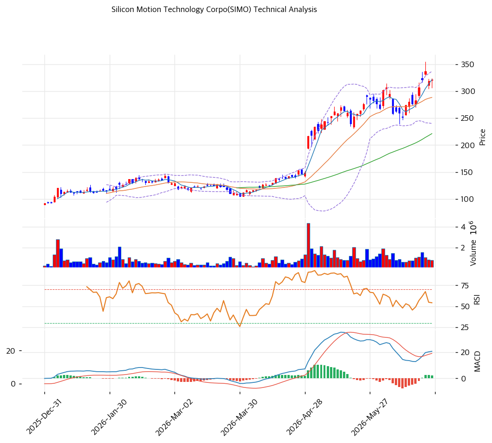

# 기술적분석

2026-06-25 | T2 Technical Analysis

***

## 차트

***

## 1. 가격 현황

| 항목        | 값               |
| --------- | --------------- |
| 현재가       | $321.66 (0.00%) |
| 52주 고가    | $336.90         |
| 52주 저가    | $69.88          |
| 52주 범위 위치 | 94.3% (고점권)     |
| 거래량비      | 0.72x (평이)      |
| RSI       | 64.3 (중립 상단)    |

> 52주 저점($69.88)에서 **약 4.6배 폭등**해 고점($336.90) 부근(pos 94.3%)에 위치. NAND 메모리 슈퍼사이클·AI 데이터센터 SSD 수요로 1년간 강한 상승 추세를 형성했다. 모든 이동평균선 위로 정배열을 이뤘으나, **MA200 대비 +131.6%로 극단적으로 확장**돼 단기 과열·되돌림 위험이 공존한다. RSI 64.3은 중립 상단으로 아직 과매수(70) 직전. 거래량은 평이(0.72x).

***

## 2. 차트 패턴 분석

### 2.1 구조·캔들

| 패턴        | 위치            | 신뢰도 | 해석       |
| --------- | ------------- | --- | -------- |
| 강세 정배열    | 전 이평선 위       | 상   | 추세 견조    |
| 고점권 과확장   | MA200 +131.6% | 상   | 되돌림 위험   |
| 스토캐 데드크로스 | 고점권           | 중   | 단기 과열 냉각 |

* **강한 상승 추세 지속** (신뢰도: 상): 완전 정배열(MA5>MA20>MA60>MA120>MA200), 추세 자체는 견조.
* **과확장·고점권** (신뢰도: 상): 52주 고점 부근(94.3%)·MA200 +131.6% 괴리로 단기 눌림 리스크. 익절 매물 출회 가능 구간.

### 2.2 다이버전스

* **단기 모멘텀 냉각** (신뢰도: 중): 스토캐스틱이 과매수권에서 데드크로스(K 74.8 < D 80.0)로 꺾여 단기 속도 조절 신호. RSI 64.3은 아직 여력 있으나 상단.

***

## 3. 이동평균선 — 완전 정배열·과확장

| MA    | 값    | 괴리율     | 위치 |
| ----- | ---- | ------- | -- |
| MA5   | $321 | +0.1%   | 부근 |
| MA20  | $288 | +11.5%  | 위  |
| MA60  | $221 | +45.4%  | 위  |
| MA120 | $171 | +88.0%  | 위  |
| MA200 | $139 | +131.6% | 위  |

**해석**: 5개 이평선 모두 아래에 둔 **완전 정배열**로 추세는 매우 강하다. 다만 MA20(+11.5%)·MA60(+45.4%)·MA200(+131.6%) 괴리가 극단적이어서, 통상 이런 과확장 구간은 **가격 횡보 또는 단기 조정으로 이평선과의 간격을 좁히는** 경향이 있다. MA20($288)이 1차 되돌림 목표·지지, MA60($221)이 강한 추세 지지선.

***

## 4. 보조 지표

### RSI(14) — 64.3 (중립 상단)

과매수(70) 직전. 추가 상승 여력은 있으나 상단권으로, 70 돌파 시 과열·되돌림 경계.

### MACD(12,26,9)

| MACD | Signal | Hist | 크로스      |
| ---- | ------ | ---- | -------- |
| +21  | +18    | +2   | 매수(영선 위) |

영선 위에서 매수 유지이나 히스토그램(+2) 확산은 둔화. 상승 모멘텀 유지하되 가속은 약화.

### 볼린저밴드(20,2σ)

| 상단   | 중단   | 하단   | 밴드폭   |
| ---- | ---- | ---- | ----- |
| $337 | $288 | $240 | 33.5% |

현재가 $321.66은 상단($337)과 중단($288) 사이. 밴드폭 33.5%로 변동성 큼. 상단 돌파 실패 시 중단($288=MA20) 회귀 가능.

### 스토캐스틱

| %K   | %D   | 판단         |
| ---- | ---- | ---------- |
| 74.8 | 80.0 | 데드크로스(고점권) |

과매수권에서 데드크로스 → 단기 속도 조절. 중기 추세 훼손은 아님.

***

## 5. 지지/저항

| 구분      | 가격          | 근거                   |
| ------- | ----------- | -------------------- |
| 저항      | $355        | 신고가권(웹 52주 고가)       |
| 저항      | $336.90     | 52주 고가(데이터)          |
| 저항      | $329        | 피봇 R1                |
| **현재가** | **$321.66** | 고점권                  |
| 지지      | $310        | 피봇 S1                |
| 지지      | $299        | 피봇 S2                |
| 지지      | $288        | MA20·볼린저 중단·피보 0.236 |
| 지지      | $246        | 피보 0.382             |
| 지지      | $221        | MA60                 |
| 지지      | $212        | 피보 0.5               |
| 지지      | $178        | 피보 0.618             |

***

## 6. 시그널 종합

| 지표    | 내용           | 시그널 |
| ----- | ------------ | --- |
| 차트 패턴 | 강세 정배열·과확장   | ⚪   |
| 이동평균선 | 완전 정배열       | 🟢  |
| RSI   | 64.3 — 중립 상단 | ⚪   |
| MACD  | 매수(영선 위)     | 🟢  |
| 볼린저밴드 | 상·중단 사이      | ⚪   |
| 스토캐스틱 | 고점권 데드크로스    | 🔴  |
| 거래량   | 평이           | ⚪   |

**종합 판단**: 🟢 매수 2개 / 🔴 매도 1개 / ⚪ 중립 4개 → **매수 우위 (강세 추세·단기 과열 병존)**

NAND 슈퍼사이클·AI SSD 수요로 1년간 4.6배 폭등한 **강한 상승 추세**가 유지되나, 52주 고점권(94.3%)·MA200 +131.6% 과확장·스토캐 데드크로스로 **단기 과열·되돌림 위험**이 공존한다. 추세 추종은 유효하되, **신규 진입은 눌림목(MA20 $288 / MA60 $221)** 을 기다리는 것이 위험 대비 유리하다. 고점권 추격매수는 변동성 손실 위험이 크다.

***

## 7. 전략 제안

### 보유 중인 경우

* **홀드 (추세 추종, 익절 분할)**
* 익절: $337(52주 고가)·$355(신고가권) 단계 분할
* 손절/비중축소: $288(MA20)·$221(MA60) 이탈
* 고점권 과확장, 트레일링 스탑 권장

### 진입 대기인 경우

* **눌림목 분할 (추격 자제)**
* 1차 진입가: $288\~$299 (MA20·피봇 S2)
* 2차 진입가: $221\~$246 (MA60·피보 0.382)
* 진입 조건: 추세는 강하나 과확장·고밸류(T3 PER 64x·평균 목표가 $273 하회). 고점 추격보다 **조정 시 분할**이 합리적. NAND 사이클 피크·실적 가이던스 변화 주시.
