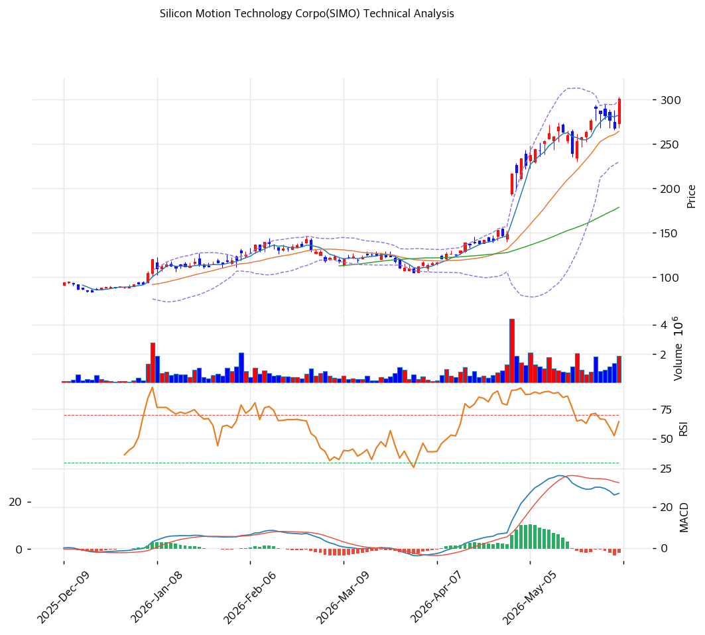

# 실리콘모션(SIMO) 기술적 분석 보고서

---

## 가격 위치

현재가 **$301.27** (보합) — **52주 신고가** 갱신, 52주 위치 **100%** (고가 $301.27 / 저가 $64.46). 1년 **+367%** ($64.46→$301.27). NAND 업사이클 + 엔터프라이즈 SSD·AI 스토리지 수요. 거래량 1.57배 증가. RSI 72.1 과매수.

## 이동평균선

| 이평선 | 값 | 이격도 | 위치 |
|------|---:|----:|:---:|
| MA5 | $283 | +6.6% | 위 |
| MA20 | $264 | +14.0% | 위 |
| MA60 | $179 | +68.4% | 위 |
| MA120 | $146 | +106.5% | 위 |
| MA200 | $123 | +145.2% | 위 |

**완전 정배열 True**. MA200 대비 +145.2%, MA20 대비 +14.0% 극단 이격. 1년 +367% 급등으로 이격 극단 — 단기 급등 정점.

## 모멘텀 지표

- **RSI 72.1 (과매수 🔴)** — 70 초과 과매수. 단기 조정 압력
- **MACD 27.0 / 시그널 28.0 / 히스토 -2.0** — 매도 전환, 확장 둔화. 모멘텀 정점 신호
- **스토캐스틱 K=75.9 / D=75.3** — 골든크로스, 중립~과매수
- **볼린저밴드** — 상단 $299 / 중심 $264 / 하단 $230, 폭 26.1%, **상단 돌파**. 변동성 확대
- **거래량비 1.57x** — 평균 대비 증가, 매수세

## 피보나치 되돌림 (스윙 $301.27 / $64.46)

| 레벨 | 가격 | 성격 |
|------|---:|------|
| 0.236 | $245 | 1차 지지 (MA20 근접) |
| 0.382 | $211 | 2차 지지 |
| 0.5 | $183 | 중기 지지 (MA60 근접) |
| 0.618 | $155 | 깊은 조정 |
| 0.786 | $116 | 추가 조정 |

## 지지/저항 (S&R)

- **저항**: $301.27(52주 고가) / $314(피봇 R1)
- **지지**: $278(피봇 S1) / **$264(MA20)** / $256(피봇 S2) / $245(피보 0.236) / $211(피보 0.382) / $183(MA60·피보 0.5)

## 종합 시그널 & 전략

**시그널: 매수 1 / 매도 2 / 중립 3 → 매도우위** (과매수 + MACD 매도 전환)

- **전략**: HOLD(비중축소) — **TP $307 / SL $256**. WAIT(관망) e1 $278 / e2 $264
- **눌림목 매수**: RSI 72.1 + 1년 +367% + MA200 +145% + MACD 매도 전환으로 **신고가 추격 비추**. 조정 시 **MA20 $264 ~ 피보 0.236 $245 분할 매수**, 깊은 조정 시 MA60 $183
- **상방**: 52주 고가 $301 돌파 시 $314. 엔터프라이즈 SSD·NAND 업사이클이 동력
- **하방**: MA20 $264 이탈 시 $245 → $211(피보 0.382). 성장 선반영 되돌림 위험
- **변곡점**: 엔터프라이즈 SSD 램프 + NAND 사이클 지속이 추세 분기점. 과매수·MACD 매도 전환으로 단기 조정 가능
