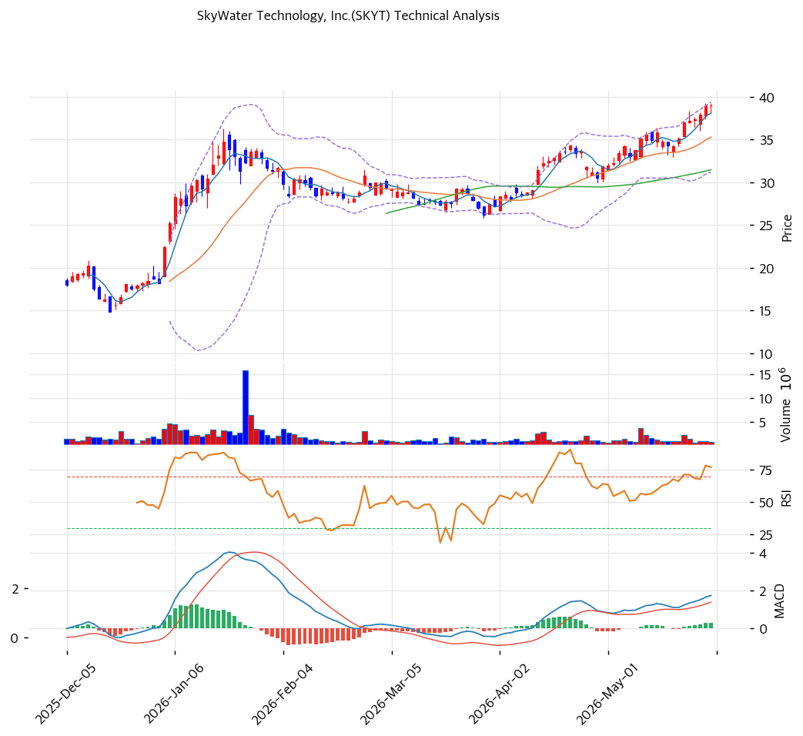

# 기술적분석

***

## 가격 위치

현재가 **$38.98** (+0.03%) — **52주 신고가** 갱신, 52주 위치 **100%** (고가 $38.98 / 저가 $8.19). 1년 **+376%** ($8.19→$38.98). 미국 트러스티드 파운드리·AI 패키징 테마 + 텍사스 팹 매출 급증. 거래량 0.67배(저조). RSI 73.3 과매수.

## 이동평균선

| 이평선   |   값 |    이격도 |  위치 |
| ----- | --: | -----: | :-: |
| MA5   | $38 |  +2.4% |  위  |
| MA20  | $35 | +10.5% |  위  |
| MA60  | $31 | +23.9% |  위  |
| MA120 | $29 | +34.8% |  위  |
| MA200 | $23 | +66.3% |  위  |

**완전 정배열 True**. MA200 대비 +66.3%, MA20 대비 +10.5% 이격. 1년 +376% 급등이나 단기 MA5(+2.4%)는 근접 — 신고가 부근 횡보 + 과열.

## 모멘텀 지표

* **RSI 73.3 (과매수 🔴)** — 70 초과 과매수. 단기 조정 압력
* **MACD 2.0 / 시그널 1.0 / 히스토 0.0** — 매수 시그널 + 확장 진행. 모멘텀 유효
* **스토캐스틱 K=94.0 / D=89.6** — 골든크로스 **과매수**(90 초과 극단)
* **볼린저밴드** — 상단 $39 / 중심 $35 / 하단 $31, 폭 23.3%(좁음), **상단 근접**. 변동성 수축 후 방향 전환 임박
* **거래량비 0.67x** — 평균 미달(신고가 부근 거래 위축)

## 피보나치 되돌림 (스윙 $39 / $8)

| 레벨       |  가격 | 성격       |
| -------- | --: | -------- |
| 0.236    | $32 | 1차 지지    |
| 0.382    | $27 | 2차 지지    |
| 0.5      | $24 | 중기 지지    |
| 0.618    | $20 | 깊은 조정 지지 |
| 1.272 확장 | $48 | 상승 시 목표  |
| 1.618 확장 | $59 | 추가 목표    |

## 지지/저항 (S\&R)

* **저항**: $38.98(52주 고가) / **$39(PRZ 약: 추세선·피봇 R1)** / $40(피봇 R2) / $48(피보 1.272)
* **지지**: **$38(PRZ 중: 피봇 S1·S2·MA5)** / $35(MA20) / $34(추세선 지지) / $32(피보 0.236) / $31(MA60) / $27(피보 0.382)

## 종합 시그널 & 전략

**시그널: 매수 2 / 매도 2 / 중립 2 → 중립** (신고가 부근 횡보 + 과매수)

* **전략**: HOLD(홀드) — **TP $40 / SL $38**. WAIT(관망) e1=$38 / e2=$35
* **눌림목 매수**: RSI 73.3 + 1년 +376%로 신고가 추격 비추. **MA20 $35 \~ MA60 $31 눌림목 분할 매수** 권고. 깊은 조정 시 피보 0.382 $27
* **상방**: 52주 고가 $39 돌파 + 영업 흑전·텍사스 팹 가동 시 피보 1.272 $48 도전
* **하방**: MA20 $35 이탈 시 $31\~27 조정. BB 폭 23.3% 수축 → 방향 전환 임박, 영업 적자로 하방 변동 큼
* **변곡점**: 영업 흑전(일회성 제외) + 텍사스 팹 가동률이 추세 분기점. PER 16.5x 일회성 착시 유의
