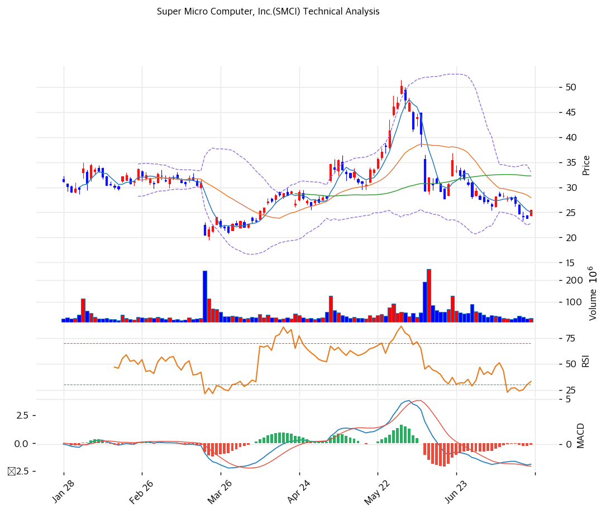

# Super Micro Computer(SMCI) 기술적 분석

## 차트

## 가격 현황

| 항목 | 값 |
|---|---|
| 현재가 | **$25.50** (+7.01% — 7/21 정규장. 프리림 발표 후 시간외 +25%, 금일 $30\~32 갭업 예상) |
| 52주 고/저 | $62.36 / $19.48 |
| 52주 위치 | 12.4% (저점권) |
| RSI | 40.1 (중립 — 침체권 반등) |
| MACD | -2.0 / -2.0 / -0.0 매도 구간 (히스토그램 0 수렴 — 골든크로스 임박) |
| Stochastic | K=17.8 D=11.0 골든크로스 (과매도) |
| 볼린저 | 폭 36.8%, 중간 (하단 $23 반등) |

## 이동평균선

| MA | 가격($) | 갭(%) | 위치 |
|---|--:|--:|---|
| MA5 | 25.0 | +1.9 | 위 |
| MA20 | 28.0 | -8.8 | 아래 |
| MA60 | 32.0 | -21.0 | 아래 |
| MA120 | 30.0 | -16.4 | 아래 |
| MA200 | 34.0 | -24.6 | 아래 |

→ **역배열** — 5월 고점($50.5) 이후 두 달 연속 하락으로 전 장기 이평 아래. 다만 시간외 가격(\~$32)은 MA20($28)·MA120($30)·MA60($32)을 단숨에 관통하는 레벨 — 갭업이 유지되면 역배열이 하루 만에 중립 구도로 바뀌는 특수 국면이다.

## 시그널 종합

| 구분 | 카운트 |
|---|--:|
| 매수 | 1 |
| 매도 | 1 |
| 중립 | 4 |
| **결론** | **중립 (지표는 7/21 종가 기준 — 프리림 갭업이 지표를 앞서감)** |

## 지지·저항

| 구분 | 가격($) | 근거 |
|---|--:|---|
| 강 저항 | 40.0 | 피보나치 0.5 되돌림 + 6월 갭 하락 시작점 |
| 저항 | 35.0 | 추세선 저항(하락) + 피보나치 0.786 |
| 저항 | 32.0 | MA60 (시간외 가격대의 1차 시험대) |
| 저항 | 28.0 | MA20 |
| **현재가** | **$25.50** | (시간외 \~$32) |
| 지지 | 25.0 | PRZ(중) — 추세선 지지 + 피봇 S1 + MA5 |
| 지지 | 23.0 | 볼린저 하단 |
| 강 지지 | 20.5 | 52주 저가 부근 ($19.48\~20.53) |

## 전략

| 시나리오 | 액션 |
|---|---|
| 보유자 | 홀드 (TP $40 — 피보나치 0.5·6월 갭 기점 / SL $24 — 갭업 전량 반납 시) |
| 신규 진입 1차 | $28\~30 (갭업 후 되돌림이 MA20~MA120 지지로 안착 확인 시) |
| 신규 진입 2차 | $25 (프리림 이전 가격 — 갭 완전 반납 시 낙폭과대 매수) |
| 매도 트리거 | 8/11 확정 실적이 프리림 GM(15\~17%) 미달 → 즉시 축소 / $40 도달 시 부분 익절 |

## 핵심 판단

차트는 5월 고점 대비 반토막(52주 위치 12.4%)의 완연한 하락 추세였으나, 7/21 프리림(GM 서프라이즈 + 수주 $60B)이 만든 시간외 +25%가 기술적 구도를 하루 만에 뒤집는 이벤트로 들어왔다. 공매도 20.8%가 쌓인 상태의 갭업이라 숏커버링이 상승을 증폭할 수 있는 반면, 6월의 학습(갭 하락 후 두 달 하락)이 보여주듯 이 종목의 갭은 되돌림도 빠르다. 기술적 기준선은 명확하다 — **갭업 가격이 MA60($32) 위에 안착하면 $35(추세선)\~$40(피보나치 0.5) 회복 시도, 갭을 반납하고 $25 아래로 밀리면 프리림 불신 = 재차 저점 테스트.** 8/11 확정 실적 전까지는 이벤트 드리븐 구간으로, 기술 지표보다 뉴스가 우선한다.
