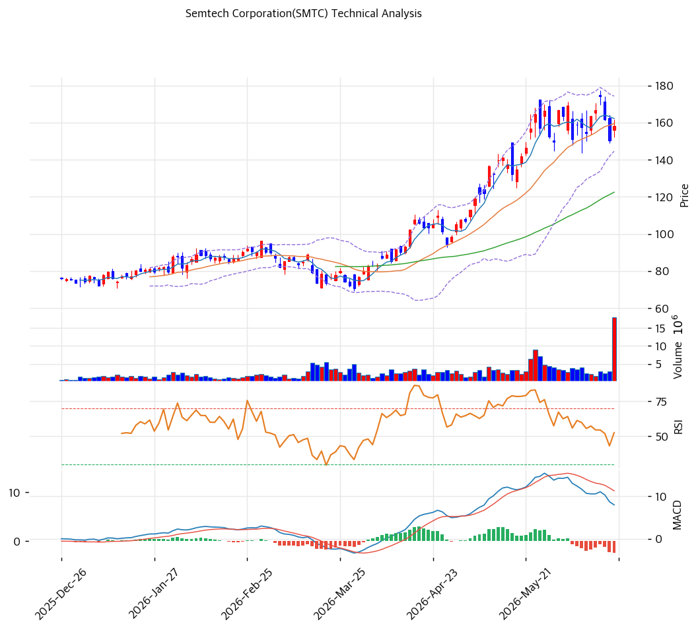

# 기술적분석

2026-06-19 | T2 Technical Analysis

***

## 차트

***

## 1. 가격 현황

| 항목        | 값           |
| --------- | ----------- |
| 현재가       | $158.23     |
| 52주 고가    | $177.35     |
| 52주 저가    | $40.25      |
| 52주 범위 위치 | 88% (상단)    |
| 거래량비      | 4.71x (급증)  |
| Beta      | 2.32 (초고변동) |

> 저점($40.25)에서 약 4배 급등해 52주 고가($177.35) 부근(88%)에서 고공권 횡보. AI 데이터센터 연결 내러티브가 주가를 견인했다. 단기선(MA5 $162·MA20 $159)에 근접, 중장기선(MA60 $123·MA120 $102·MA200 $89) 대비 큰 폭 위. 거래량 4.71x 급증·Beta 2.32로 변동성 극심.

***

## 2. 차트 패턴 분석

### 2.1 캔들스틱 패턴

| 패턴          | 위치             | 신뢰도 | 해석           |
| ----------- | -------------- | --- | ------------ |
| 고점권 횡보      | $158 ≈ 고가 $177 | 중   | 급등 후 숨고르기    |
| 거래량 급증      | 4.71x          | 중   | 변동성 확대·매물 교차 |
| 단기 데드크로스 시도 | MACD/스토캐       | 중   | 단기 모멘텀 둔화    |

※ 주요 캔들 패턴: 망치형, 역망치형, 장악형, 도지, 샛별/석별, 적삼병/흑삼병, 하라미, 유성형, 교수형 등

### 2.2 가격 구조 패턴

* **장기 상승 추세 + 고점권 횡보** (신뢰도: 중상) $40→$177 대상승 후 $158대 고공권 횡보. 정배열(aligned True) 유지 중이나 단기 과열 부담.
* **단기 눌림 시도** (신뢰도: 중) MA5($162)·MA20($159) 근접에서 단기 조정 압력. 지지 유지 시 재상승, 이탈 시 MA60($123)까지 공백.

※ 주요 구조 패턴: 이중천정/바닥, 삼각수렴, 쐐기형, 깃발형, 페넌트, 컵앤핸들, 박스권 등

### 2.3 다이버전스

* **단기 모멘텀 둔화** (신뢰도: 중) RSI 54.1 중립·MACD 매도 전환·스토캐 데드크로스. 가격은 고공권이나 모멘텀 지표 둔화 → 단기 조정 경계.

※ RSI·MACD 기반 | 상승 다이버전스 = 가격↓ 지표↑, 하락 다이버전스 = 가격↑ 지표↓

### 2.4 패턴 종합 판단

저점 대비 4배 급등 후 52주 고가($177) 부근에서 고공권 횡보하는 국면. 중장기 정배열(MA60/120/200 위)은 강건하나, 단기선(MA5·MA20)에 근접하며 MACD 매도 전환·스토캐 데드크로스로 **단기 모멘텀이 둔화**됐다. 거래량 4.71x 급증은 고점권 매물 교차를 시사. **MA20($159)·피봇 S1($153) 지지 유지 여부**가 단기 방향을 결정하며, 이탈 시 MA60($123)까지 갭이 크다. 정배열 추세는 유효하나 과열·고변동을 감안한 분할 대응 구간.

***

## 3. 이동평균선 — 정배열(중장기 강세)·단기 눌림

| MA    | 값    | 현재가 괴리율 | 위치 |
| ----- | ---- | ------- | -- |
| MA5   | $162 | -2.5%   | 아래 |
| MA20  | $159 | -0.8%   | 아래 |
| MA60  | $123 | +29.1%  | 위  |
| MA120 | $102 | +54.4%  | 위  |
| MA200 | $89  | +78.1%  | 위  |

**해석**: 현재가가 단기선(MA5 $162·MA20 $159) 바로 아래로 **단기 눌림**이나, 중장기선(MA60 $123·MA120 $102·MA200 $89) 대비 +29\~78%로 **강한 정배열**(aligned True). MA200 대비 +78%는 장기 과열 신호이기도 하다. MA20($159) 회복 여부가 단기 분수령, 이탈 시 MA60($123)이 다음 지지.

***

## 4. 보조 지표

### RSI(14) — 54.1 (중립)

급등 후 중립권으로 복귀. 과매수 해소됐으나 약세 전환은 아님.

### MACD(12,26,9)

| 항목        | 값         |
| --------- | --------- |
| MACD      | \~8.0     |
| Signal    | \~10.0    |
| Histogram | \~-2.0    |
| 크로스 상태    | 매도 전환(확산) |

**해석**: MACD가 Signal 하향 돌파(매도 전환), 히스토그램 음(-) 확대 → 단기 하락 모멘텀. 고점권 조정 신호.

### 볼린저밴드(20, 2σ)

| 항목        | 값          |
| --------- | ---------- |
| 상단        | $174       |
| 중단 (MA20) | $159       |
| 하단        | $145       |
| 밴드 폭      | 18.6% (변동) |
| 현재 위치     | 중간         |

**해석**: 현재가 $158.23은 중단($159) 부근. 상단($174)·하단($145) 사이 중간권. 밴드 폭 18.6%로 변동성 존재. 중단 이탈 시 하단($145) 시험.

### 스토캐스틱(14, 3, 3)

| 항목      | 값      |
| ------- | ------ |
| Slow %K | 38.7   |
| Slow %D | 56.1   |
| 크로스 상태  | 데드크로스  |
| 판단      | 중립(하향) |

**해석**: K=38.7로 중립권 하향. 데드크로스로 단기 약세 기울기. 과매도(20 이하) 아님 → 추가 조정 여지.

***

## 5. 지지/저항 — 추세선 · 피보나치 · PRZ 통합

### 5.1 종합 지지/저항 테이블

| 구분      | 가격          | 근거                      |
| ------- | ----------- | ----------------------- |
| 저항      | $177        | 52주 고가                  |
| 저항      | $174        | 볼린저 상단                  |
| 저항      | $163        | 피봇 R1                   |
| 저항      | $161        | PRZ(강) — 추세선·MA20·MA5   |
| **현재가** | **$158.23** | 고공권 횡보                  |
| 지지      | $159        | MA20                    |
| 지지      | $153        | 피봇 S1                   |
| 지지      | $148        | 피봇 S2·전략 SL             |
| 지지      | $146        | PRZ(약) — 피보 0.236·피봇 S2 |
| 지지      | $145        | 볼린저 하단                  |
| 지지      | $125        | 피보 0.382                |
| 지지      | $124        | PRZ(약) — MA60·피보 0.382  |
| 지지      | $123        | MA60                    |
| 지지      | $109        | 피보 0.5                  |
| 지지      | $93         | 피보 0.618                |

***

## 6. 시그널 종합

| 지표    | 내용               | 시그널 |
| ----- | ---------------- | --- |
| 차트 패턴 | 정배열·고점권 횡보       | 🟢  |
| 이동평균선 | 정배열, 단기 눌림       | 🟢  |
| RSI   | 54.1 — 중립        | ⚪   |
| MACD  | 매도 전환(확산)        | 🔴  |
| 볼린저밴드 | 중단 부근, 밴드폭 18.6% | ⚪   |
| 스토캐스틱 | 데드크로스, K=38.7    | ⚪   |
| 거래량   | 4.71x 급증         | ⚪   |

**종합 판단**: 🟢 매수 2개 / 🔴 매도 1개 / ⚪ 중립 3개 → **매수 우위 (단기 과열 경계)**

저점 대비 4배 급등 후 52주 고가 부근 고공권 횡보. 중장기 정배열은 강건하나 MACD 매도 전환·스토캐 데드크로스로 단기 모멘텀 둔화, 거래량 4.71x 급증으로 매물 교차. **MA20($159)·피봇 S1($153) 지지가 단기 분수령**이며 이탈 시 볼린저 하단($145)·MA60($123)까지 갭이 크다. Beta 2.32 초고변동이라 추격보다 **지지 확인 후 분할**이 유효.

***

## 7. 전략 제안

### 보유 중인 경우

* **홀드 (고점권 트레일링)**
* 익절 라인: $163(피봇 R1)·$174(볼린저 상단)·$177(52주 고가)
* 손절 라인: $148 (피봇 S2 이탈)
* 리스크/리워드: 초고변동(Beta 2.32), 분할 익절·트레일링 스톱

### 진입 대기인 경우

* **눌림목 분할 (추격 자제)**
* 1차 진입가: $153\~159 (피봇 S1·MA20)
* 2차 진입가: $145\~148 (볼린저 하단·피봇 S2)
* 진입 조건: 4배 급등·고밸류·초고변동 감안, MA20 지지 확인 후 분할. MA20 이탈·데이터센터 모멘텀 둔화 시 MA60($123)대까지 관망.
