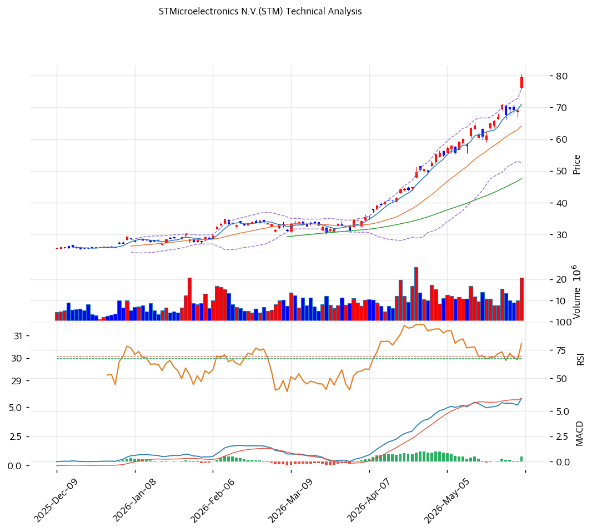

# 기술적분석

***

## 가격 위치

현재가 **$79.51** (보합) — **52주 신고가** 갱신, 52주 위치 **100%** (고가 $79.51 / 저가 $21.07). 1년 **+277%** ($21.07→$79.51). 차량·산업 반도체 사이클 회복 기대 + SiC·MCU. 거래량 1.83배 증가. RSI 80.9 극단 과매수.

## 이동평균선

| 이평선   |   값 |     이격도 |  위치 |
| ----- | --: | ------: | :-: |
| MA5   | $71 |  +12.0% |  위  |
| MA20  | $64 |  +24.0% |  위  |
| MA60  | $48 |  +66.9% |  위  |
| MA120 | $38 | +106.6% |  위  |
| MA200 | $33 | +137.5% |  위  |

**완전 정배열 True**. MA200 대비 +137.5%, MA20 대비 +24.0% 극단 이격. 1년 +277% 급등으로 이격 극단 — 단기 급등 정점.

## 모멘텀 지표

* **RSI 80.9 (극단 과매수 🔴)** — 80 초과 역사적 극단. 단기 조정 압력 큼
* **MACD 6.0 / 시그널 6.0 / 히스토 1.0** — 매수 + 확장 진행(모멘텀 유효)
* **스토캐스틱 K=90.1 / D=88.1** — 골든크로스 **과매수**(90 초과 극단)
* **볼린저밴드** — 상단 $76 / 중심 $64 / 하단 $53, 폭 36.3%, **상단 돌파**. 변동성 확대
* **거래량비 1.83x** — 평균 대비 급증, 매수세 강함

## 피보나치 되돌림 (스윙 $79.51 / $21.07)

| 레벨    |  가격 | 성격               |
| ----- | --: | ---------------- |
| 0.236 | $67 | 1차 지지 (MA5 근접)   |
| 0.382 | $58 | 2차 지지            |
| 0.5   | $51 | 중기 지지            |
| 0.618 | $44 | 깊은 조정            |
| 0.786 | $33 | 추가 조정 (MA200 근접) |

## 지지/저항 (S\&R)

* **저항**: $79.51(52주 고가) / $82(피봇 R1)
* **지지**: $77(피봇 S1) / $74(피봇 S2) / $67(피보 0.236) / **$64(MA20)** / $58(피보 0.382) / $51(피보 0.5) / $48(MA60)

## 종합 시그널 & 전략

**시그널: 매수 2 / 매도 3 / 중립 2 → 매도우위** (극단 과매수)

* **전략**: HOLD(비중축소) — **TP $81 / SL $74**. WAIT(관망) e1 $77 / e2 $64
* **눌림목 매수**: RSI 80.9 + 1년 +277% + MA200 +137%로 **신고가 추격 비추**. 조정 시 **MA20 $64 \~ 피보 0.382 $58 분할 매수**, 깊은 조정 시 MA60 $48
* **상방**: 52주 고가 $79.51 돌파 시 $82. 사이클 회복 가시화가 동력
* **하방**: 피보 0.236 $67·MA20 $64 이탈 시 $58\~51 조정. 회복 선반영 되돌림 위험
* **변곡점**: 차량·산업 반도체 수요 회복(분기 매출·OPM 정상화)이 추세 분기점. 극단 과매수로 단기 변동성 큼
