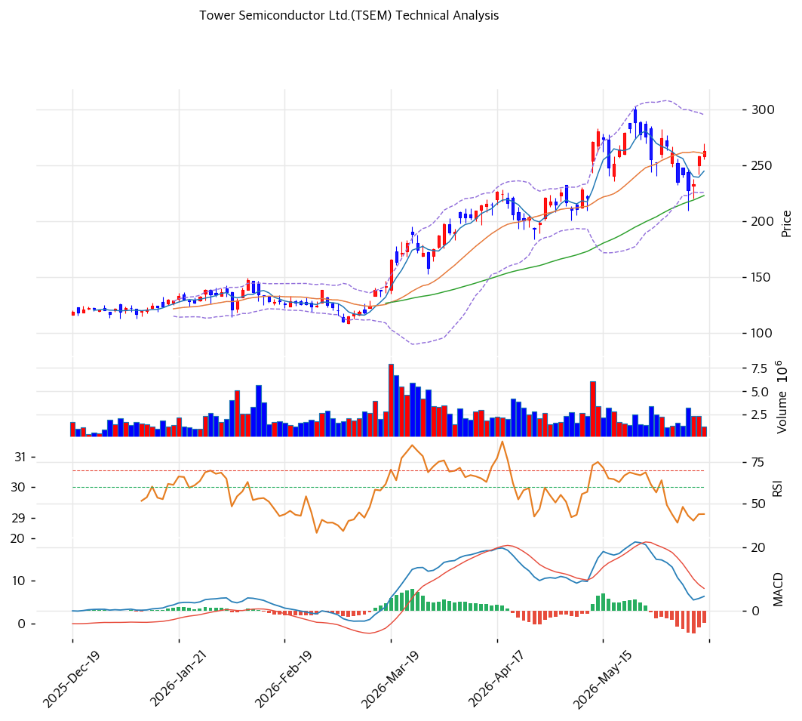

# Tower Semiconductor(TSEM) 기술적 분석

2026-06-15 | T2 Technical Analysis

---

## 차트

---

## 1. 가격 현황

| 항목 | 값 |
|------|-----|
| 현재가 | $262.92 |
| 52주 고가 | $302.86 |
| 52주 저가 | $38.42 |
| 52주 범위 위치 | \~85% (고점 대비 조정) |
| 거래량 | 20일 평균 대비 0.56x (위축) |

> 52주 저점($38.42) 대비 +512% 폭등 후 **고점($303)에서 조정**(현재 $262). 5종목 배치와 달리 신고가가 아닌 **눌림·소화 국면** — MACD 매도 전환·거래량 위축. MA200 대비 +89% 장기 과열은 잔존.

---

## 2. 차트 패턴 분석

### 2.1 캔들스틱 패턴

| 패턴 | 위치 | 신뢰도 | 해석 |
|------|------|--------|------|
| 고점 대비 조정 | $303 → $262 (-13%) | 중 | 매도 — 차익실현 소화 |
| MA20 부근 등락 | 현재 $262 ≈ MA20 $261 | 중 | 중립 — 단기선 공방 |
| 거래량 위축 | 0.56x | 중 | 관망·에너지 감소 |

※ 주요 캔들 패턴: 망치형, 역망치형, 장악형, 도지, 샛별/석별, 적삼병/흑삼병, 하라미, 유성형, 교수형 등

### 2.2 가격 구조 패턴

- **고점 대비 조정·박스 소화** (신뢰도: 중)
  $303 고점 후 MA20($261) 부근 등락. SiPho 모멘텀 소화 국면. 피보 0.382($252)·0.5($241)가 조정 지지 후보.

- **장기 상승 추세 과열** (신뢰도: 강)
  MA200($139) 대비 +89%의 큰 괴리로 1년 +512% 강세. 추세 강하나 평균회귀 압력 크고 단기 모멘텀은 둔화.

※ 주요 구조 패턴: 이중천정/바닥, 헤드앤숄더, 삼각수렴, 쐐기형, 깃발형, 페넌트, 컵앤핸들, 박스권 등

### 2.3 다이버전스

- **단기 모멘텀 둔화** (신뢰도: 중)
  가격이 고점에서 조정되며 MACD 매도 전환(히스토그램 음). RSI 55.2로 중립까지 냉각. 과열이 일부 해소됐으나 추세 둔화 신호.

※ RSI·MACD 기반 | 상승 다이버전스 = 가격↓ 지표↑, 하락 다이버전스 = 가격↑ 지표↓

### 2.4 패턴 종합 판단

+512% 폭등 후 **고점 조정·소화** 국면이다. MA20($261) 부근에서 공방하며 MACD 매도·거래량 위축(0.56x)으로 단기 모멘텀이 둔화됐다. SiPho 펀더멘털은 강하나 극단 밸류·과열로 변동성이 크다. 신규 진입은 추격보다 조정 지지($252\~255 PRZ) 확인이 안전하며, 밸류 부담상 적극 매수는 권하기 어렵다.

---

## 3. 이동평균선 — 비정배열 (단기 둔화)

| MA | 값 | 현재가 괴리율 | 위치 |
|----|-----|--------------|------|
| MA5 | $245 | +7.3% | 위 |
| MA20 | $261 | +0.8% | 위(근접) |
| MA60 | $223 | +17.8% | 위 |
| MA120 | $175 | +50.2% | 위 |
| MA200 | $139 | +89.3% | 위 |

**해석**: 현재가가 모든 MA 위이나 **MA5($245)가 MA20($261) 아래로 단기 데드크로스(aligned=False)** — 단기 모멘텀 둔화. 현재가는 MA20($261)에 거의 붙어 공방 중. MA200($139) 대비 +89%로 장기 추세는 강하나 과열. MA20 이탈 시 MA60($223)까지 조정 여지.

---

## 4. 보조 지표

### RSI(14) — 55.2 (중립)

폭등 후 조정으로 과매수에서 중립까지 냉각. 추가 조정·재상승 모두 열린 중립 구간.

### MACD(12,26,9)

| 항목 | 값 |
|------|-----|
| MACD | \~5.0 |
| Signal | \~8.0 |
| Histogram | -4.0 |
| 크로스 상태 | 매도 (데드크로스) |

**해석**: MACD가 Signal 아래의 매도 구간, 히스토그램 음(-4)으로 단기 하락 모멘텀. 고점 조정 반영.

### 볼린저밴드(20, 2σ)

| 항목 | 값 |
|------|-----|
| 상단 | $295 |
| 중단 (MA20) | $261 |
| 하단 | $226 |
| 밴드 폭 | 26.6% |
| 현재 위치 | 중간(중단 부근) |

**해석**: 현재가 $262가 중단(MA20 $261) 부근. 밴드 내 중립. 추가 조정 시 하단($226·MA60 부근) 여지, 반등 시 상단($295) 재도전.

### 스토캐스틱(14, 3, 3)

| 항목 | 값 |
|------|-----|
| Slow %K | 44.9 |
| Slow %D | 32.2 |
| 크로스 상태 | 골든크로스 |
| 판단 | 중립(저점 반등 시도) |

---

## 5. 지지/저항 — 추세선 · 피보나치 · PRZ 통합

### 5.1 피보나치 되돌림/확장

| 구분 | 비율 | 가격 | 현재가 대비 |
|------|------|------|-----------|
| 확장 | 1.382 | $325 | +23.6% |
| 확장 | 1.272 | $314 | +19.4% |
| 저항 | 0.236 | $266 | +1.2% |
| **현재가** | — | $262.92 | — |
| 지지 | 0.382 | $252 | -4.2% |
| 지지 | 0.5 | $241 | -8.3% |
| 지지 | 0.618 | $230 | -12.5% |
| 지지 | 0.786 | $214 | -18.6% |

### 5.2 종합 지지/저항 테이블

| 구분 | 가격 | 근거 |
|------|------|------|
| 저항 | $314 | 피보 1.272 확장 |
| 저항 | $302.86 | 52주 고가 |
| 저항 | $285\~288 | 추세선 저항·전고 |
| 저항 | $270 | 피봇 R1 |
| 저항 | $266 | 피보 0.236 |
| **현재가** | **$262.92** | MA20 근접 |
| 지지 | $261 | MA20 |
| 지지 | $256 | 피봇 S1 |
| 지지 | $255 | PRZ(강) — 피보 0.5·MA5·피봇 S2 |
| 지지 | $252 | 피보 0.382 |
| 지지 | $223 | MA60 |

---

## 6. 시그널 종합

| 지표 | 내용 | 시그널 |
|------|------|--------|
| 차트 패턴 | 고점 조정·소화 | 🔴 |
| 이동평균선 | 비정배열(MA5<MA20), MA200 +89% | ⚪ |
| RSI | 55.2 — 중립(냉각) | ⚪ |
| MACD | 매도(데드크로스) | ⚪ |
| 볼린저밴드 | 중단 부근 | ⚪ |
| 스토캐스틱 | 골든크로스, K=44.9 | ⚪ |
| 거래량 | 0.56x — 위축 | ⚪ |

**종합 판단**: 🟢 매수 0개 / 🔴 매도 1개 / ⚪ 중립 5개 → **매도우위 (폭등 후 조정·소화)**

+512% 폭등 후 고점($303)에서 조정·소화 국면이다. MA5<MA20 단기 데드크로스·MACD 매도·거래량 위축으로 단기 모멘텀이 둔화됐다. RSI 55로 과열은 일부 해소. SiPho 펀더멘털은 강하나 극단 밸류·과열로 변동성이 크다. 추격·신규 적극매수보다 조정 지지($252\~255 PRZ·MA60 $223) 확인 후 소량 접근이 정석.

---

## 7. 전략 제안

### 보유 중인 경우
- **비중축소 / 분할 익절**
- 익절 라인: $285\~288(전고·추세선) / $302(52주 고가)
- 손절 라인: $241 (피보 0.5 이탈) / 적극적으론 MA20 $261 이탈
- 리스크/리워드: +512% 폭등·극단 밸류로 차익실현 우선 고려

### 진입 대기인 경우
- **신규 적극 진입 비권장 (밸류 부담)**
- 1차 관찰가: $255 (PRZ 강 — 피보 0.5·MA5·피봇 S2)
- 2차 관찰가: $223 (MA60)
- 진입 조건: EV/Rev 17.4x·PER 121x의 극단 밸류로 차트 반등만으로 진입은 위험. 깊은 조정($223 MA60 이하)에서 SiPho 수주잔고·마진 지속 확인 시 소량. 추격 금지.
