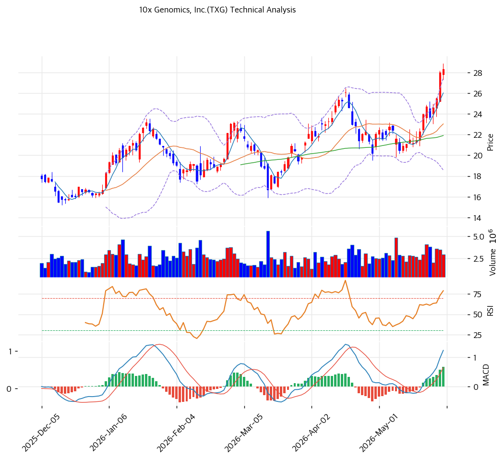

# 기술적분석

***

## 가격 위치

현재가 **$28.31** (+1.13%) — **52주 신고가** 갱신, 52주 위치 **100%** (고가 $28.31 / 저가 $9.11). 1년 **+211%** ($9.11→$28.31). 단일세포·공간 유전체 + 적자 축소·흑전 기대. 거래량 1.0배(평균). RSI 72.3 과매수.

## 이동평균선

| 이평선   |   값 |    이격도 |  위치 |
| ----- | --: | -----: | :-: |
| MA5   | $26 |  +8.8% |  위  |
| MA20  | $23 | +22.9% |  위  |
| MA60  | $22 | +29.2% |  위  |
| MA120 | $20 | +38.1% |  위  |
| MA200 | $18 | +58.3% |  위  |

**완전 정배열 True**. MA200 대비 +58.3%, MA20 대비 +22.9% 이격. 1년 +211% 급등으로 단기 이격 큼 — 추세 강세이나 과열.

## 모멘텀 지표

* **RSI 72.3 (과매수 🔴)** — 70 초과 과매수. 단기 조정 압력
* **MACD 1.0 / 시그널 1.0 / 히스토 1.0** — 매수 시그널 + 확장 진행. 모멘텀 유효
* **스토캐스틱 K=96.8 / D=92.7** — 골든크로스 **과매수**(96 초과 극단)
* **볼린저밴드** — 상단 $27 / 중심 $23 / 하단 $19, 폭 38.7%, **상단 근접**. 변동성 확대
* **거래량비 1.0x** — 평균 수준

## 피보나치 되돌림 (스윙 $28 / $9)

| 레벨       |  가격 | 성격              |
| -------- | --: | --------------- |
| 0.236    | $24 | 1차 지지 (MA20 동조) |
| 0.382    | $21 | 2차 지지           |
| 0.5      | $19 | 중기 지지           |
| 0.618    | $17 | 깊은 조정 지지        |
| 1.272 확장 | $34 | 상승 시 목표         |
| 1.382 확장 | $36 | 추가 목표           |

## 지지/저항 (S\&R)

* **저항**: $28.31(52주 고가) / $29(피봇 R1) / **$30(PRZ 약: 추세선·피봇 R2)** / $34(피보 1.272)
* **지지**: **$27(PRZ 약: 피봇 S1·S2)** / $24(피보 0.236) / $23(MA20) / $22(MA60) / **$20(PRZ 약: 추세선·MA120)** / $21(피보 0.382)

## 종합 시그널 & 전략

**시그널: 매수 2 / 매도 3 / 중립 2 → 매도우위** (과매수 + 신고가)

* **전략**: HOLD(비중축소) — **TP $29 / SL $27**. WAIT(관망) e1=$27 / e2=$23
* **눌림목 매수**: RSI 72.3 + 스토캐 96.8 + 1년 +211%로 신고가 추격 비추. **MA20 $23 \~ MA60 $22 눌림목 분할 매수** 권고. 깊은 조정 시 MA120 $20
* **상방**: 52주 고가 $28.31 안착 + 흑전·신제품 가시화 시 피보 1.272 $34 도전
* **하방**: MA20 $23 이탈 시 $22\~20 조정. NIH 예산 우려 시 변동 큼
* **변곡점**: 영업 흑전(일회성 제외) + NIH 예산 안정 + 신제품 매출이 추세 분기점. Fwd PE 138x 흑전 초기 유의
