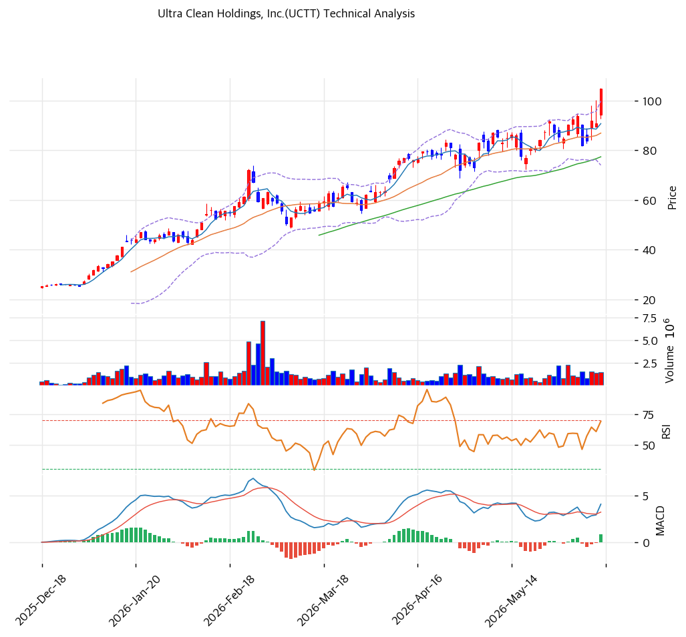

# Ultra Clean Holdings(UCTT) 기술적 분석

## 차트

## 가격 현황

| 항목 | 값 |
|---|---|
| 현재가 | **$104.83** (+15.32%) |
| 52주 고/저 | $104.93 / $19.51 |
| 52주 위치 | 100.0% |
| RSI | 67.1 (중립, 과매수 근접) |
| MACD | 매수 |
| Stochastic | 골든크로스 (중립) |
| 볼린저 | 상단 근접 |

## 이동평균선

| MA | 가격($) | 갭(%) | 위치 |
|---|--:|--:|---|
| MA5 | 91 | +15.6 | 위 |
| MA20 | 87 | +20.6 | 위 |
| MA60 | 77 | +35.5 | 위 |
| MA120 | 62 | +70.1 | 위 |
| MA200 | 48 | +120.5 | 위 |

→ **완전 정배열** 강세. MA200 대비 +120.5%의 극단 괴리로 매우 강한 상승 추세이나 단기 과열 극심. 당일 +15.32% 급등으로 52주 신고가 경신.

## 시그널 종합

| 구분 | 카운트 |
|---|--:|
| 매수 | 2 |
| 매도 | 1 |
| 중립 | 4 |
| **결론** | **매수우위 (단기 과열 동반)** |

## 지지·저항

| 구분 | 가격($) | 근거 |
|---|--:|---|
| 강 저항 | 109 | 피봇 R1 |
| 저항 | 104.9 | 52주 고가 |
| **현재가** | **$104.83** | 신고가권 |
| 지지 | 97 | 피봇 S1 |
| 강 지지 | 87\~88 | MA20·피봇 S2 |

## 전략

| 시나리오 | 액션 |
|---|---|
| 보유자 | 분할 익절 (TP $109 / SL $88) |
| 신규 진입 1차 | $97 (피봇 S1) |
| 신규 진입 2차 | $87 (MA20·피봇 S2 눌림) |
| 매도 트리거 | $87 종가 이탈 (MA20·추세 훼손) |

## 핵심 판단

UCTT는 $19.5 → $104.8로 1년 5배 급등한 강력한 상승 추세주로, 당일 +15.32% 급등(거래량 1.28배)으로 52주 신고가를 경신했다. 완전 정배열·MACD 매수·매수우위 시그널로 추세가 강하나, MA200 대비 +120.5%·RSI 67 과매수 근접의 극단 과열이 공존한다. AI/HPC WFE 회복·FY26Q2 $565\~605M 가이던스가 추세를 받치지만, beta 1.95·공매도 9.2%로 변동성이 매우 크다. 추격은 위험하며 $87\~97(MA20·피봇 S1) 눌림목 분할이 정석이다. 차입 부담·순손실 잔존이 펀더멘털 하방 변수다.
