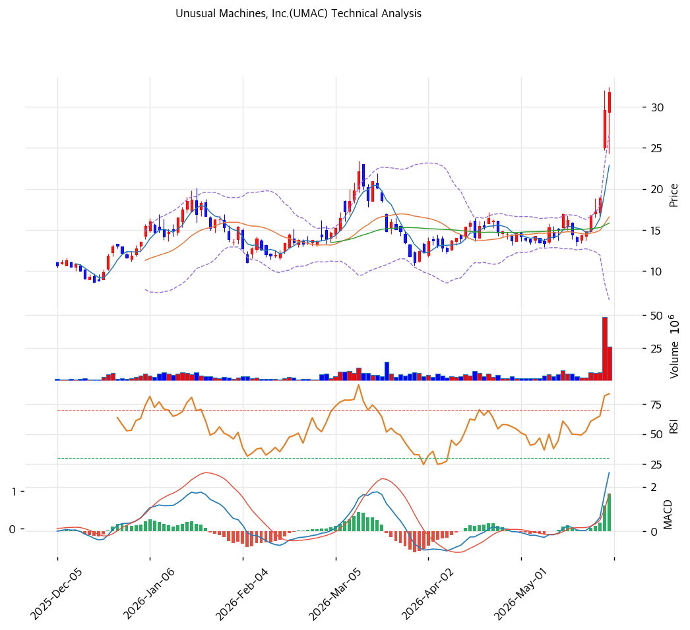

# 기술적분석

***

## 가격 위치

현재가 **$31.78** (+7.36%) — **52주 신고가** 갱신, 52주 위치 **100%** (고가 $31.78 / 저가 $5.52). 1년 **+476%** ($5.52→$31.78). 미국 드론 국산화(NDAA·Blue UAS) 테마 + 매출 급증. 거래량 4.06배 폭증. RSI 82.5 극단 과매수.

## 이동평균선

| 이평선   |   값 |     이격도 |  위치 |
| ----- | --: | ------: | :-: |
| MA5   | $23 |  +39.1% |  위  |
| MA20  | $17 |  +91.5% |  위  |
| MA60  | $16 | +100.6% |  위  |
| MA120 | $15 | +116.9% |  위  |
| MA200 | $13 | +136.5% |  위  |

**완전 정배열 True**. MA200 대비 +136.5%, MA20 대비 +91.5% 극단 이격. 1년 +476% 급등으로 이격도 극단 — 단기 급등 정점.

## 모멘텀 지표

* **RSI 82.5 (극단 과매수 🔴)** — 80 초과 역사적 극단. 단기 조정 압력 큼
* **MACD 3.0 / 시그널 1.0 / 히스토 2.0** — 매수 + 확장 진행(급등 모멘텀)
* **스토캐스틱 K=93.3 / D=88.6** — 골든크로스 **과매수**(90 초과 극단)
* **볼린저밴드** — 상단 $27 / 중심 $17 / 하단 $6, 폭 **121.8% 극단**, 상단 근접. 변동성 폭발
* **거래량비 4.06x** — 평균 4배 폭증, 투기적 급등

## 피보나치 되돌림 (스윙 $32 / $5.5)

| 레벨       |  가격 | 성격              |
| -------- | --: | --------------- |
| 0.236    | $26 | 1차 지지 (MA20 위)  |
| 0.382    | $22 | 2차 지지           |
| 0.5      | $19 | 중기 지지           |
| 0.618    | $16 | 깊은 조정 (MA60 동조) |
| 0.786    | $11 | 추가 조정           |
| 1.272 확장 | $40 | 상승 시 목표         |
| 2.0 확장   | $60 | 추가 목표           |

## 지지/저항 (S\&R)

* **저항**: $31.78(52주 고가) / $35(피봇 R1) / $38(피봇 R2) / $40(피보 1.272)
* **지지**: $27(피봇 S1·피보 0.236) / $22(피봇 S2·피보 0.382) / $19(피보 0.5) / **$17(MA20)** / $16(MA60·피보 0.618) / $11(피보 0.786)

## 종합 시그널 & 전략

**시그널: 매수 3 / 매도 3 / 중립 1 → 중립** (추세 강세 vs 극단 과매수 상충)

* **전략**: HOLD(홀드) — **TP $32 / SL $21**. WAIT(관망) e1=$27 / e2=$17
* **눌림목 매수**: RSI 82.5 + 1년 +476% + BB 121.8% 극단으로 **추격 강력 비추**. 단기 -40\~60% 급락 시 MA20 $17 \~ 피보 0.5 $19 분할 매수
* **상방**: 52주 고가 $31.78 돌파 시 피보 1.272 $40 도전 (드론 정책 수주 시)
* **하방**: MA20 $17 이탈 시 $16\~11 급락. EV/Revenue 71.8x 극단 고평가로 조정 폭 큼
* **변곡점**: NDAA·Blue UAS 정책 수주 + 매출 $50M+ 가시화가 추세 분기점. 펀더멘털(적자) 대비 극단 투기
