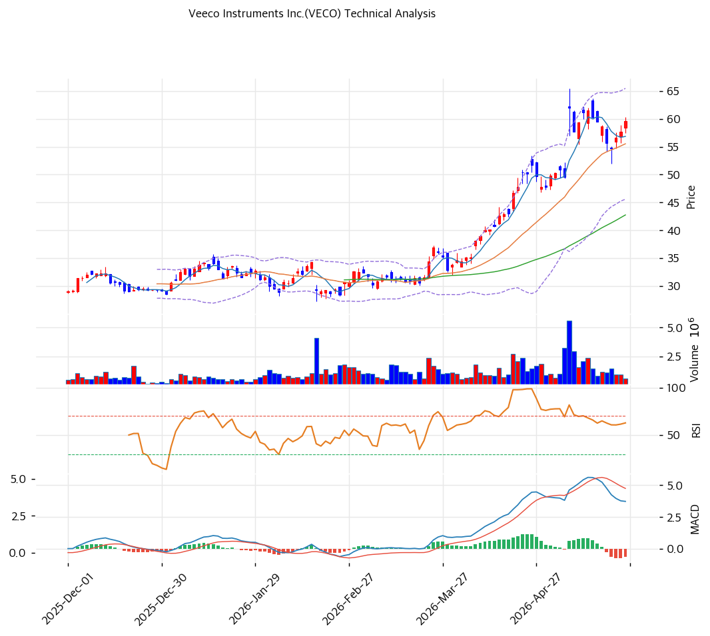

# Veeco Instruments Inc.(VECO) 기술적 분석

## 차트

## 가격 현황

| 항목 | 값 |
|---|---|
| 현재가 | **$59.55** (52주 91.0% 상단) |
| 52주 고/저 | $65.43 / $19.04 (**3.12배** 반등) |
| 52주 위치 | **91.0%** |
| RSI | 64.3 🟡 중립 |
| MACD | 매수 시그널 |
| Stoch | 골든크로스 (중립 영역) |
| 볼린저 | 중간 |
| Beta | 1.36 (시장 대비 변동성 큼) |

## 이동평균선

| MA | 가격($) | 갭(%) | 위치 |
|---|--:|--:|---|
| MA5 | ~57 | +4.5 | 위 |
| MA20 | ~48 | +24.1 | 위 (과열) |
| MA60 | ~36 | +65.4 | 위 (강한 과열) |
| MA120 | ~30 | +98.5 | 위 (극단) |
| MA200 | ~28 | +112.7 | 위 (극단) |

→ **정배열 완성**. MA200 +112.7% = 극단 이격이나 RSI 64.3 중립 = 모멘텀 둔화 시그널.

## 시그널 종합

| 구분 | 카운트 |
|---|--:|
| 매수 | 1 |
| 매도 | 1 |
| 중립 | 4 |
| **결론** | **중립** |

## 지지·저항

| 구분 | 가격($) | 근거 |
|---|--:|---|
| 강 저항 | **65.43** | 52주 고가 |
| **현재가** | **59.55** | |
| 지지 | ~57 | MA5 |
| 강 지지 | ~48 | MA20 |
| 지지 | ~36 | MA60 |
| 강 지지 | ~30 | MA120 |
| 강 지지 | ~28 | MA200 |
| 극한 지지 | 19.04 | 52주 저점 |

## 전략

| 시나리오 | 액션 |
|---|---|
| 보유자 | **홀드** (TP $65→$70) / SL $48 |
| 신규 진입 1차 | **$48** (MA20, -19%) 30% |
| 신규 진입 2차 | **$36** (MA60, -40%) 30% |
| 신규 진입 3차 | **$30** (MA120, -50%) 30% |
| 매도 트리거 | FY2026 Q2 매출 < $150M / $28 이탈 (MA200) |
| 추세 가속 | **$65.43 (52주 고가)** 돌파 + 거래량 +50% → $75 도전 |

## 수급 분석

| 주체 | 값 | 해석 |
|---|--:|---|
| Institutional | **110.7%** | 강한 기관 매집 (중복 보유) |
| Insider | 2.7% | 낮음 |
| Short Ratio | **5.03** | 높음 — 공매도 압력 + 숏스퀴즈 가능성 양면 |

## 핵심 판단

$19.04 → $59.55 (3.12배, 6개월) 반등 후 **RSI 64.3 중립 + MA200 +113% 극단 이격** = 모멘텀 둔화. 52주 고가 $65.43 저항 테스트 중. **$65 돌파 시 신고가 추세 가속, 실패 시 MA20 $48 영역 조정 가능**. 8분기 연속 매출 감소 + OP 적자 전환 감안 시 **FY2026 Q2 실적이 방향 결정 핵심**. 보유자 홀드, 신규 진입은 $48(MA20) 분할 매수 권장.
