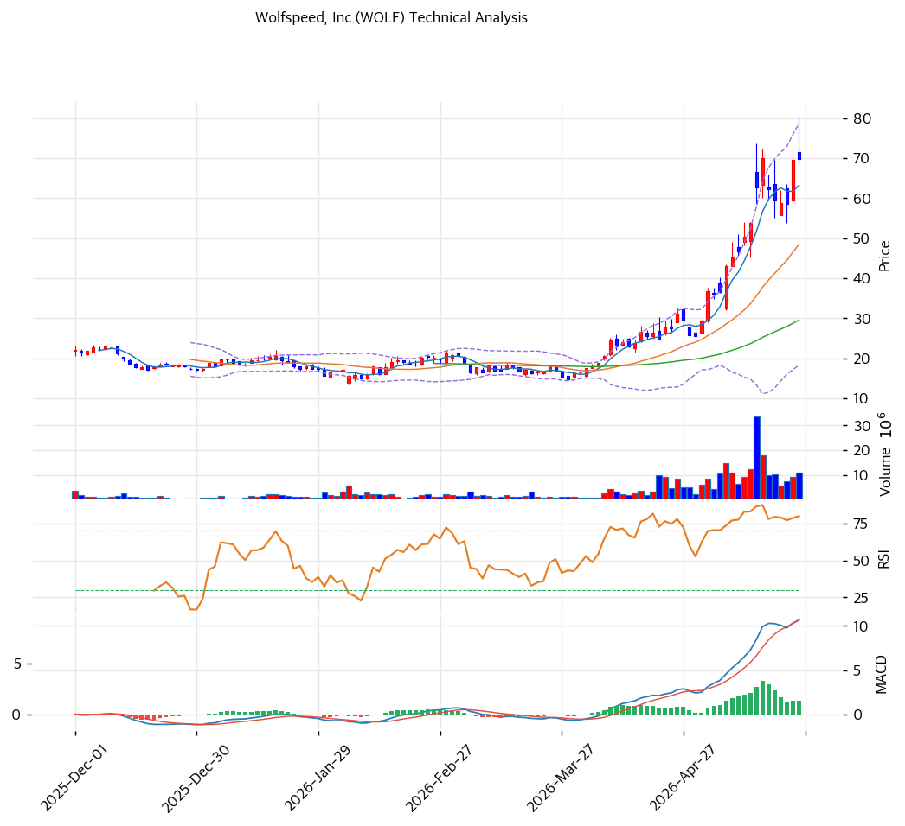

# 기술적분석

## 차트

## 가격 현황

| 항목      | 값                                 |
| ------- | --------------------------------- |
| 현재가     | **$69.89** (52주 99.9% 상단)         |
| 52주 고/저 | $80.82 / **$8.05** (**8.68배** 반등) |
| 52주 위치  | **99.9% 상단** 🔴                   |
| RSI     | **76.4 🔴 과매수**                   |
| MACD    | 11/9/1 매수 (확장 약함)                 |
| Stoch   | K=77.9, D=73.7 골든크로스 (중립 영역)      |
| 볼린저     | 폭 **124.6%** (매우 넓음), 중간          |
| 거래량     | 1.1x (평균 수준)                      |

## 이동평균선

| MA    | 가격($) |       갭(%) | 위치                        |
| ----- | ----: | ---------: | ------------------------- |
| MA5   |  63.0 |      +10.5 | 위                         |
| MA20  |  48.0 |  **+44.1** | 위 (과열)                    |
| MA60  |  30.0 | **+136.2** | 위 (극단)                    |
| MA120 |  24.0 | **+189.3** | 위 (매우 극단)                 |
| MA200 |   N/A |        N/A | 데이터 부족 (Chapter 11 후 재상장) |

→ **정배열 완성** (MA5>MA20>MA60>MA120). MA120 +189.3% = 6개월 평균의 **2.89배** 이격 = **극단 과열**. 볼린저 밴드 폭 124.6%는 통상 20~~40% 대비 3~~6배 → 변동성 극대.

## 시그널 종합

| 구분     |                      카운트 |
| ------ | -----------------------: |
| 매수     |                 1 (MACD) |
| 매도     | 2 (RSI 과매수, MA120 극단 이격) |
| 중립     |                        4 |
| **결론** |          **매도우위 → 비중축소** |

## 지지·저항 (PRZ 강화 영역)

| 구분          |     가격($) | 근거                            |
| ----------- | --------: | ----------------------------- |
| 저항          |  **86.0** | PRZ (약) — 피봇 R2 + 피보 1.382 확장 |
| 강 저항        |  **82.0** | 피보 1.272 확장                   |
| 저항          |     80.82 | 52주 고가                        |
| 저항          |      78.0 | 피봇 R1                         |
| **현재가**     | **69.89** |                               |
| 지지          |      65.0 | 피봇 S1                         |
| **PRZ (약)** |  **60.0** | 피보 0.236 되돌림 + 피봇 S2          |
| 지지          |      55.0 | 추세선 저항(상승)                    |
| 강 지지        |      53.0 | 피보 0.382                      |
| 강 지지        |  **48.0** | MA20 + 피보 0.5                 |
| 지지          |      43.0 | 피보 0.618                      |
| 지지          |      35.0 | 피보 0.786                      |
| 강 지지        |      30.0 | MA60                          |
| 강 지지        |      24.0 | MA120                         |
| 극한 지지       |      14.0 | 추세선 지지(하락)                    |

## 전략

| 시나리오     | 액션                                              |
| -------- | ----------------------------------------------- |
| 보유자      | **30\~50% 익절** (TP $71→$82) / SL $60            |
| 신규 진입 1차 | **$55\~60** (피봇 S2 + 피보 0.236, -14\~-21%) 30%   |
| 신규 진입 2차 | **$48** (MA20 + 피보 0.5, -31%) 30%               |
| 신규 진입 3차 | **$35\~43** (피보 0.618~~0.786, -38~~-50%) 30%    |
| 매도 트리거   | $30 이탈 (MA60) / 분기 OP -$800M↓                   |
| 추세 가속    | **$80.82 (52주 고가)** 돌파 + 거래량 +50% → $86→$100 도전 |

## 수급 분석

| 주체            |          값 | 해석                             |
| ------------- | ---------: | ------------------------------ |
| Institutional | **125.3%** | 극단적 기관 매집 (중복 보유, 레버리지 ETF 포함) |
| Insider       |  **0.27%** | 매우 낮음 — 경영진 확신 부족 시그널          |
| Short Ratio   |   **4.47** | 높음 — 공매도 압력 + 숏스퀴즈 가능성 양면      |

**기관 125%**: Chapter 11 emerge 후 신주를 기관(채권자 전환)이 대부분 보유 + 레버리지 ETF 중복 집계. 실질 float가 적어 **변동성 극심**.

## 핵심 판단

**$8.05 → $69.89 (8.68배, 6개월) 폭등 후 RSI 76.4 + MA120 +189.3% 매우 극단 과열** = 단기 평균회귀 -30\~-50% 압력 매우 큼. 그러나 SiC 구조적 성장 + Chapter 11 emerge + 기관 125% 매집 = **펀더멘털 turnaround 기대 강력**.

볼린저 밴드 폭 124.6% (통상 3~~6배) = 향후 2~~4주 내 급격한 방향 결정 예상. **$80.82 (52주 고가) 돌파 시 숏스퀴즈 + 추세 가속**, **$60 이탈 시 피보 0.236 → $48(MA20) 빠른 조정** 양 갈래.

보유자는 30~~50% 익절 후 잔량 홀드. 신규 진입은 반드시 \*\*$55~~60 또는 $48(MA20) 영역 분할 매수\*\* 권장. SL $30(MA60). 적자 turnaround 종목이므로 변동성 +50\~-50% 정상 범위.
