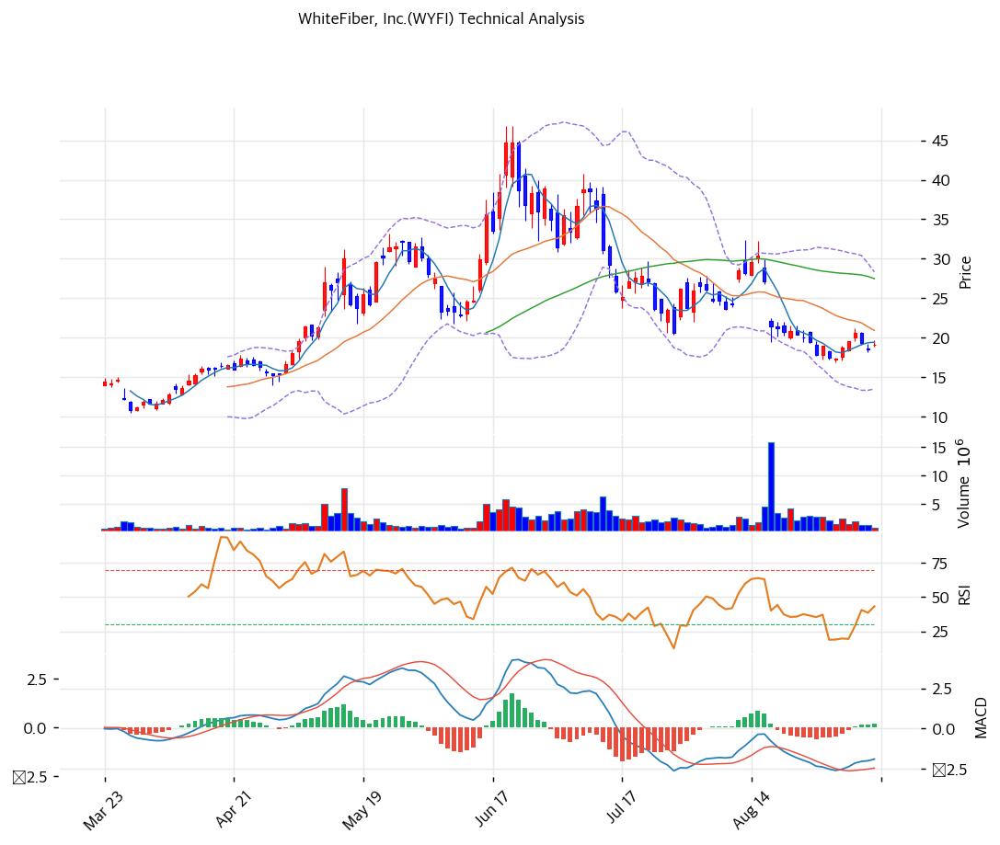

# WhiteFiber, Inc.(WYFI) 기술적 분석

## 차트

## 가격 현황

| 항목 | 값 |
|---|---|
| 현재가 | **$19.14** (+3.29%) |
| 52주 고/저 | $46.87 (2026-06-22) / $10.51 (2026-03-27) |
| 52주 위치 | 23.7% |
| RSI | 42.2 (중립) |
| MACD | -1.88 / -2.08 / +0.20 (골든크로스, 히스토그램 확대) |
| Stochastic | K=43.7 D=46.2 데드크로스 (중립) |
| 볼린저 | 폭 71.0%, 중단($20.91) 아래 |

상장 13개월 만에 저점 $10.51에서 고점 $46.87까지 4.5배 올랐다가 다시 59% 내려온 상태다. 8월 18일 $27.07에서 전환사채 발행 공시 이후 9월 2일 $16.81까지 38% 급락했고, 이후 $17\~21 구간에서 바닥을 다지는 중이다.

## 이동평균선

| MA | 가격($) | 갭(%) | 위치 |
|---|--:|--:|---|
| MA5 | 19.42 | -1.4 | 아래 |
| MA20 | 20.91 | -8.4 | 아래 |
| MA60 | 27.47 | -30.3 | 아래 |
| MA120 | 24.06 | -20.4 | 아래 |
| MA200 | 21.58 | -11.3 | 아래 |

→ **완전 비정배열(약세)**. 모든 이동평균선 아래에 있고 단기선이 장기선을 아래로 관통한 상태다. MA60($27.47)과 MA120($24.06) 사이가 두꺼운 매물대이며, 반등이 나와도 $21(MA20)과 $24(MA120)에서 차례로 저항을 받는다. 다만 MA5와의 괴리가 -1.4%로 좁혀져 단기 낙폭은 일단 멈췄다.

## 시그널 종합

| 구분 | 카운트 |
|---|--:|
| 매수 | 1 |
| 매도 | 2 |
| 중립 | 4 |
| **결론** | **중립(약세 편향)** |

MACD가 시그널선을 상향 돌파해 유일한 매수 신호를 냈고, 이동평균 비정배열과 MA20 하회가 매도 신호다. 거래량은 20일 평균 297만 주 대비 83만 주(0.28배)로 크게 줄어 방향성 확인이 안 된 상태다.

## 지지·저항

| 구분 | 가격($) | 근거 |
|---|--:|---|
| 강 저항 | 33.84 | 2032년 전환사채 전환가 |
| 저항 | 25.91 | 2031년 전환사채 전환가, MA60 부근 |
| 저항 | 24.06 | MA120, 피보나치 0.382 되돌림($24.4) |
| 저항 | 20.91 | MA20, 볼린저 중단 |
| **현재가** | **$19.14** | 피보나치 0.236 되돌림($19.1) 부근 |
| 지지 | 17.25 | 8월 31일·9월 1일 저점대 |
| 지지 | 16.81 | 9월 2일 저점 |
| 강 지지 | 13.49 | 볼린저 하단 |

피보나치는 고점 $46.87과 저점 $10.51을 기준으로 계산했다. 현재가가 0.236 되돌림($19.1)에 정확히 걸쳐 있어, 이 선을 지키면 $21\~24 반등, 내주면 $16.8까지 열린다.

## 전략

| 시나리오 | 액션 |
|---|---|
| 보유자 | 홀드 (TP $24.0 / SL $16.8) |
| 신규 진입 1차 | $17.3 (9월 초 저점대 지지 확인 후) |
| 신규 진입 2차 | $15.5 (볼린저 하단과 저점 사이 눌림) |
| 매도 트리거 | 종가 $16.8 이탈 또는 3분기 콜로케이션 매출이 분기 $10M을 밑돌 때 |

## 핵심 판단

추세는 명백한 하락이다. 5개 이동평균선 모두 위에 있고 MA60까지 -30% 떨어져 있어 기술적으로는 반등해도 매물대가 겹겹이다. 다만 RSI 42.2는 과매도가 아니고, MACD 골든크로스와 거래량 급감은 투매가 끝나가는 국면에서 나오는 조합이다. 8월 급락의 원인이 실적이 아니라 전환사채 발행에 따른 희석 우려였던 만큼, 3분기 실적에서 NC-1 40MW 가동 효과가 숫자로 확인되면 $24(MA120) 회복이 1차 목표가 된다. 반대로 $16.8을 내주면 상장 이후 저점 $10.51까지 지지선이 없다시피 하다.
